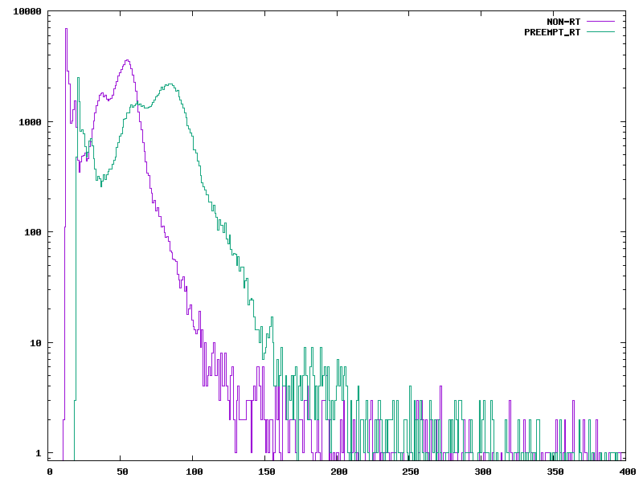

# HW 6

## Julia YT Questions

1. NI  
2. In the realtime kernel patch of the linux kernel, the OS scheduler will try to optimize for lowest worst-case latency. It will be most responsive to actions you want   
3. Two different degrees of time-sensitivity present   
4. different aplications share the driver stacks   
5. latency between actual event and realtime event   
6. it is the time difference between its expected sleep time and actual sleep time  
7. its the histogram of the latency in a Cyclictest   
8. Dispatch latency: time between the interrupt triggering and its relevant thread being able to react.  
   Scheduling latency: time for CPU to get the task after thread schedules it  
9. Non-real-time way to handle interrupts   
10. a low-priority interrupt currently being executed  
11. A small event fragment is used to wake up or preempt new thread; even during a regular low-priority interrupt 

## part 2:

### Plot under load

In the loaded plot the two kernels act very similarly, only with the RT one lagging a little behind in general

### Plot under no load

Under no load, the RT kernel has a maximum latency for every event of around 200us but has an odd bimodal distribution with a second peack around 75us. With the regular kernel, its wors-case scneario is worst than the RT but doesn't have the additional peak that the RT kernel does.
