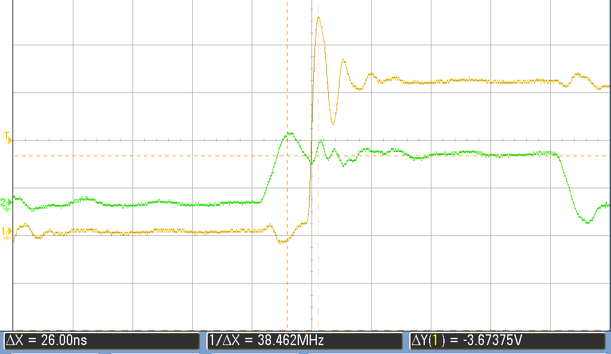

# HW08

## Table  
| Section                | Notes | Screenshot |
|------------------------|-------|------------|
| 2.6 | I acheived 80ns period for this part |  |
| 5.3 | The pru toggle aceived a much smaller peiod with much less gitter compared to regular GPIO | |
| 5.4 | We are able to acheive 3.27KHz frequency with all of the channes for PWM | |
| 5.9 | From input to output of controlling through the pru gives us a delay of about 25ns ||

## 2.6: Blinking LED 
What make command will start your PRU code running?  
```
cp <generated files> /lib/firmware/am35xx-pru0-fw  
tee /sys/class/remoteproc/remoteproc#/state start
```

What will stop it?  
```
tee /sys/class/remoteproc/remoteproc#/state stop
```

## Prof. Yoder's comments

Looks good.

Late: -1
Grade:  9/10
